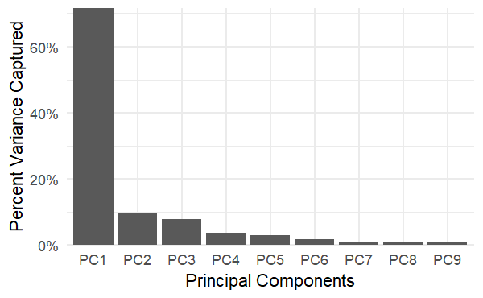

# Lab 4: PCAs & The Human Development Index (HDI)

This lab was a learning module as part of the ESM 244 course in Advanced Data Analysis Methods.

**What I learned, and the type of analysis I can quickly support:**
- **Language**: R
- **Data Analysis Methods:** Principal Components Analysis ([stats](https://cran.r-project.org/web/packages/stats/index.html))

### Screeplot of variance captured per principal component

### Main Principal Components and their variable loadings

